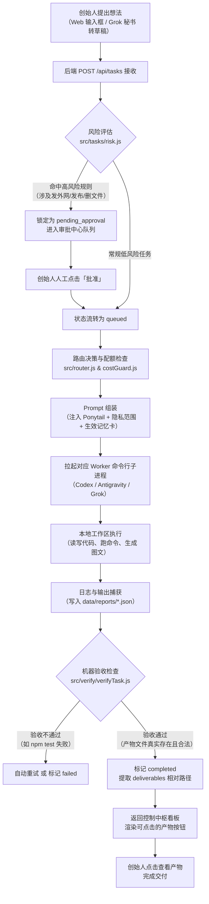

# SYSTEM_SNAPSHOT.md — AI Founder OS (Superme) 系统全景审计与交接档案

> **审计基准时间**：2026-09-03  
> **审计原则**：纯事实陈述，不夸大、不美化、不假设不存在的功能。  
> **运行环境**：Windows 11 本地单机环境（Node.js v22+，工作区：`c:\Users\22145\Desktop\superme`）。

---

## 1. PROJECT OVERVIEW

### 1.1 当前项目是什么
Superme 是一个在本地 PC 运行的 **AI Founder OS（创始人操作系统中央控制中枢）**。它的核心定位是作为创始人的“AI CEO / 本机控制系统”，统一调度本地的多家 AI 命令行 Worker（Codex、Antigravity、Claude、Grok、Hermes），管理任务流、高风险审批、记忆资产，并将书籍知识自动转化为小红书等平台的高质量内容资产。

### 1.2 最终目标是什么
- **最高宪法目标**：将创始人从日常执行琐事中彻底释放，创始人只负责“想法、方向、审美判断、高风险批准”；
- **小红书经营目标**：实现从“选书 → 7 角色对抗提炼洞察 → 视觉排版 → 审批与发布 → 真实数据回流 → 漏斗诊断与策略学习”的端到端自动化经营闭环，让下一批内容比上一批更贴合目标受众；
- **控制目标**：实现“Human by Exception”（异常时才找人），实现系统每日“需要创始人决策：0”。

### 1.3 当前已经可以工作的功能（VERIFIED）
1. **控制中枢服务**：基于 Express 的本地控制台（默认端口 `3210`），提供桌面 Web 端与手机端适配界面（`/phone`）；
2. **多 Worker 派工与执行引擎**：
   - 支持通过本地 CLI 调用 Codex（ChatGPT 订阅会话）、Antigravity（Gemini 3.8 Flash High）、Claude（反向代理/CLI）、Grok（grok.exe CLI）、Hermes；
   - 包含 CostGuard 机制，强制阻断商业付费 API，耗尽时自动降级到其他订阅 Worker；
3. **高风险拦截与签字队列**：
   - 自动识别涉及发消息、发布、扣费、大规模文件删除等高风险意向，强制锁定在 `pending_approval`，必须创始人点击「批准」才可执行；
   - 永久封死 Worker 自动向外发布接口（`/api/content/packages/:id/send` 恒定 403）；
4. **统一记忆账本 (Memory Ledger)**：
   - 提取候选记忆 (`candidates`) → 创始人确认 (`items`) → 版本更新与废弃 (`superseded`)；
   - 敏感信息（Token、密码、卡号）在入库前自动正则拦截拒存；
   - 任务派工时通过 `buildPrompt` 自动安全注入生效记忆；
5. **小红书内容包与图文生产体系 (Shuzhai)**：
   - 维护素材事实、候选表达、观点卡片（带授权范围）；
   - 冻结包哈希（SHA-256 锁定），内容修改立即撤销审批；
   - 本地离线渲染 6 张 1080×1440 艺术馆叙事插画风格的高定图文；
   - 本地 `xhs-mcp` 扫码上号与批准后发布；
6. **数据复盘闭环 (P0-1 & P0-2)**：
   - 后端支持发布前 Experiment Snapshot 与发布后 Metrics 追加，不破坏发布内容哈希；
   - 前端支持 2 分钟手工录入 9 项真实指标及采集时间，实时计算点击率、收藏率、互动率、转化率，并展示 3 级归因状态标签；
7. **Grok Bot 私人秘书交互**：
   - 本机 Web 聊天界面，调用 `grok -p` 进行对话，支持“转为收件箱草稿”与“设为规则（调教人格）”；
8. **自动化测试**：全量 138 项测试 100% 通过（`npm test`）。

### 1.4 当前仍未完成的功能
- **自动数据回流**：小红书数据目前必须由创始人人工查看后台并手动在 P0-2 界面录入，尚未接入全自动免登录采集；
- **全自动 7 角色对抗流水线**：7 角色规则已写进宪法与规范，但尚未固化为一键自动依次博弈派工的脚本；
- **P1-1 漏斗自动诊断器**：尚未将录入的数据与账号历史基线对比输出成败原因；
- **P1-2 假设升级引擎**：尚未将多次实验结果自动汇总提炼为 Strategy Memory；
- **P1-3 每日 CEO 压缩简报**：尚未每日定时自动生成；
- **主动通知系统**：没有微信/飞书/Telegram 外部主动推送，待审批任务需创始人主动打开中枢查看。

---

## 2. DIRECTORY MAP

```text
superme/
├── .agents/                    # Agent 专用配置与技能定义（如 grilling 拷打技能）
├── assets/                     # 视觉与排版公共静态资源（思源宋体字体文件、公有领域名画素材）
├── config/                     # 系统环境配置与规则
│   └── skills/                 # 本地安装的各专业 Skill 定义
├── config.json                 # 本地运行时配置（端口、代理 7890、Worker 路径与模型、Bridge Token）
├── data/                       # 本地全量数据存储目录（纯 JSON / 纯文本，无 SQL 数据库）
│   ├── archive/                # 归档的历史任务
│   ├── billing/                # 费用与配额告警记录
│   ├── content/packages/       # 小红书内容发布包（JSON，含事实/观点/版式/实验快照/Metrics）
│   ├── memory/                 # 记忆账本（candidates 候选卡、items 生效卡、bridge_audit 审计流水）
│   ├── quota/                  # 各 Worker 订阅配额耗尽/正常状态记录
│   ├── reports/                # 任务执行日志与 CLI 详细产物
│   ├── reviews/                # 任务复盘与 Review 记录
│   ├── secretary/              # 秘书线数据（chat 对话记录、inbox 收件箱草稿、processed 已处理）
│   ├── tasks/                  # 当前活跃与近期任务的 JSON 状态文件
│   └── trash/                  # 任务回收站
├── docs/                       # 架构设计与排版规范文档（SHUZHAI_XIAOHONGSHU_LAYOUT.md 等）
├── founder_os/                 # Founder OS 最高立宪与核心规范（公司最高法）
│   ├── BRIEF.md                # 统一需求简报（文案铁律、五轴验收、排版铁律、7 角色工作流）
│   ├── CONTENT_OPERATING_SYSTEM.md # 内容经营宪法 v1.0（24 张标准卡组）
│   ├── CURRENT_STATE.md        # 系统当前演进里程碑记录
│   ├── FOUNDER_MODEL.md        # 创始人思维与人机分工模型
│   ├── GOVERNANCE.md           # Worker 治理与配额规则
│   ├── GROK_BOT_PERSONA.md     # Grok Bot 秘书人格与调教记录
│   ├── READ_SCOPE.md           # 计算机读取隐私护栏（资金、Token、隐私路径隔离规约）
│   ├── XHS_CONTENT_OS_BUILD_PLAN.md # 小红书闭环 P0~P3 落地实施计划
│   └── projects/               # 各子业务定义（SHUZHAI.md 书斋项目定义、YUANDIAN.md 等）
├── public/                     # 控制中枢前端 Web 静态资源（纯原生 HTML/JS/CSS，无外部框架）
│   ├── app.js                  # 前端核心业务逻辑（任务渲染、审批、记忆卡、内容包、录数抽屉、Grok 对话）
│   ├── index.html              # 控制中枢单页面结构
│   ├── style.css               # Couture 高定暗黑法式视觉样式表
│   └── bridge/                 # 外部集成插件（chatgpt-extract.user.js 油猴脚本）
├── scripts/                    # 运维与启动辅助脚本（start-phone.js 手机端启动器等）
├── src/                        # 后端核心源码（Node.js ESM）
│   ├── access/                 # 权限与访问控制（电脑读写范围限制）
│   ├── adapters/               # 各 AI Worker 的命令行适配器（codex、antigravity、claude、grok、hermes）
│   ├── billing/                # 费用保护与配额政策（CostGuard）
│   ├── content/                # 内容包生命周期、哈希计算、小红书版式规划（store.js、xiaohongshuLayout.js）
│   ├── integrations/           # 外部生态接入（hermes 桌面启动器与 bridge、xhs 本地发布通道）
│   ├── memory/                 # 记忆账本核心增删改查与 Prompt 组装（store.js）
│   ├── policy/                 # 安全策略拦截器（readScope.js 隐私保护过滤）
│   ├── publish/                # 小红书发布与 MCP 交互适配层
│   ├── secretary/              # 秘书线实现（chat.js 对话引擎、inbox.js 草稿箱、persona.js 人格维护）
│   ├── store.js                # 任务主存储与状态机（创建、派工、暂停、重试、删除）
│   ├── router.js               # 意向解析与 Worker 自动路由决策器
│   └── verify/                 # 任务验收与产物检查器（verifyTask.js）
├── test/                       # 自动化测试套件（32 个测试文件，138 项测试）
├── server.js                   # 系统主后端入口（Express，端口 3210）
└── 小红书/                     # 已生产出的图文物料产物目录（按主题与日期分目录存放）
```

---

## 3. ARCHITECTURE

### 3.1 前端 (Frontend)
- **技术栈**：纯原生 HTML5 + 原生 JavaScript (ES6+) + 原生 CSS3；
- **设计模式**：遵循 Ponytail 极简原则，**零外部前端框架**（无 React/Vue），**零 NPM 构建步骤**；
- **通信方式**：原生 `fetch()` 轮询与 REST API 交互；
- **适配**：桌面端（侧边导航 + 多面板）与移动端（Bottom Sheet + 响应式双列网格）双模式。

### 3.2 后端 (Backend)
- **技术栈**：Node.js (ESM 模块规范) + Express 5；
- **职责**：
  1. 托管前端静态资产；
  2. 暴露任务、记忆、发布包、Worker 状态、审批、秘书等 59 个 REST 接口；
  3. 执行本地进程级安全网关（命令行参数转义、工作目录限定、超时强杀）；
  4. 维护定时任务清理回收站（Retention Policy）。

### 3.3 Electron
- **事实状态**：**Superme 本身不是 Electron 应用程序**，而是纯 Node.js 服务。
- 项目中涉及的 Electron 是：通过 `src/integrations/hermes/launcher.js` 可以唤起本机已安装的 Hermes 独立客户端（`Hermes.exe`）。

### 3.4 数据存储 (Data Storage)
- **无 SQL 数据库**（无 MySQL、无 PostgreSQL、无 SQLite）；
- **数据持久化形式**：本地磁盘上的 JSON 文件（按 ID 散列存储在 `data/` 下）与 Markdown 规范文件；
- **读写方式**：同步/异步 Node.js `fs` 文件读写，哈希验签防篡改。

### 3.5 Agent 系统 (Worker Ecosystem)
- 系统本质是一个 **CLI 适配调度器**；
- 不通过官方付费 API 直连（严格遵守 CostGuard），而是通过本机安装的各 AI 桌面/CLI 工具调用；
- 每次任务执行拉起一个独立子进程（`child_process.spawn`），注入本地代理环境变量（`127.0.0.1:7890`），收集 stdout/stderr 并写入日志。

### 3.6 Task 系统
- 具备完整的有限状态机：`queued` → `running` → `completed` / `failed` / `cancelled`；
- 包含 `pending_approval`（高风险拦截）与 `paused`（挂起）中间状态；
- 每个 Task 记录执行历史（`executionHistory`）、重试次数、使用的 Worker、日志路径以及验收结果（`verification`）。

### 3.7 文件系统与安全边界
- 设有 `READ_SCOPE.md` 规约与 `src/policy/readScope.js` 检查器；
- 严禁读取 Windows AppData、密钥、浏览器凭据、财务账单、银行账户；
- 即使 Worker 读取文本，入库前也会自动脱敏货币金额和个人身份信息。

### 3.8 Memory 系统
- 两级存储：`candidates/`（待审候选卡）与 `items/`（生效记忆卡）；
- 支持类型：`judgment`（品味判断）、`rule`（铁律）、`fact`（事实）；
- 支持授权标签：`understand_only`（仅用于理解上下文，严禁对外引用）、`influence_or_paraphrase`（可重述）、`attributable`（可公开引用）；
- 支持版本链：通过 `supersedes` 关联上一版本，旧版本自动失效（`status: "superseded"`）。

### 3.9 Queue / Event / WebSocket
- **事实状态**：**当前系统中不存在 Redis、RabbitMQ 等消息队列，也不存在 WebSocket**；
- 状态同步完全依赖前端定时轮询（`setInterval`）；
- 任务执行采用并发锁与排队机制处理（内存中追踪活跃任务进程）。

---

## 4. AI / AGENT INVENTORY

| Agent 名称 | 当前用途 | 是否真正接入 | 调用方式 | 输入 | 输出 | 权限范围 | 当前真实问题 |
| :--- | :--- | :--- | :--- | :--- | :--- | :--- | :--- |
| **ChatGPT** | 想法碰撞与观点提取 | **部分接入** (桥接) | 通过浏览器 Tampermonkey 脚本抓取聊天记录，POST 到 `/api/bridge/chatgpt/extract` | 网页端对话 turns | 写入 `data/memory/candidates` 候选记忆卡 | 只读提取，无本地执行权 | 需要人工在网页操作，且依赖预置 Bridge Token |
| **Antigravity** | 核心架构、代码修改、全量测试 | **已真正接入** | 本机 CLI：`agy.exe --mode accept-edits --model gemini-3.8-flash-high` | 任务意向 Prompt + 项目上下文 + 记忆 | 修改后源码、终端输出、测试结果 | **最高权限**：受 `dangerous-bypass` 保护绕过，可在工作区修改文件和跑命令 | 若未开启 `dangerous-bypass` 会在无头模式因权限弹窗而挂起 |
| **Codex** | 后端逻辑、数据持久化、底层协议 | **已真正接入** | 本机 CLI：`codex exec --sandbox workspace-write -m gpt-5.6-luna` | 标准输入 JSON 流与 Prompt | stdout/stderr JSON 流，写入源码 | 仅限于工作区写权限，不可越权访问工作区外 | 依赖 ChatGPT 网页端订阅 Session 登录态，偶发 Session 过期需重新登录 |
| **Grok Build** | 批量素材搜索、外部信息调研 | **已真正接入** | 本机 CLI：`grok.exe -p <prompt> --always-approve` | Prompt 字符串 | 纯文本研究结论 | CLI 执行权限 | 依赖 X Premium 订阅的网页授权，国内需稳定代理 |
| **Grok Bot** | 创始人桌面私人秘书 | **已真正接入** (文本交互) | 控制中枢内部调用：`grok.exe -p <prompt>` (无 `--always-approve`) | 秘书人格文件 + 最近 10 轮对话 + 创始人输入 | 秘书回复文本、建议任务草稿、建议记忆卡 | **零执行权限**：不跑命令、不改文件、不建 Task | 无法主动读取项目文件和看板状态，无法向外推消息 |
| **Hermes** | 复杂业务协调、外部信息雷达 | **已真正接入** | 本机 CLI：`hermes.exe chat --query-file ...` (Provider: `gemini-proxy`) | 任务描述文件 | 执行结果与文本回复 | 本地工作区工具权限 | 需本地配置好的反向代理与运行环境，偶发连接超时 |
| **Claude** | 任务审查、代码 Review、QC | **部分接入** | 本机 CLI：`claude -p` 或通过本地 3456 端口反向代理 | 审核 Prompt + Diff 内容 | 审查打分与修正建议 | 只读/执行环境 | 依赖本机 3456 端口的反向代理活跃，代理关闭时自动不可用 |
| **DeepSeek** | 备用 API 兜底 | **已定义/受限** | 通过 Hermes 的 `--provider deepseek` 接入 | 结构化 Prompt | 文本回复 | 受限于 Hermes 接口 | 属于付费 Token 计费模式，默认被 CostGuard 规则严格限制 |

---

## 5. FOUNDER OS / CENTRAL CONTROL CENTER

### 5.1 页面结构
单一入口的仪表盘页面（`public/index.html`），左侧为固定导航轨（桌面端），顶部为状态与手机配对提示，主体分为九大面板。

### 5.2 功能与按钮真实可用性审计

| 区域 / 面板 | 界面元素 / 按钮 | 对应后端接口 | 真实可用性 | 说明 |
| :--- | :--- | :--- | :--- | :--- |
| **发起任务** | 输入框 `#description` + 「发起任务」按钮 | `POST /api/tasks` | **真实可用** | 创建任务，自动路由 Worker 并异步拉起进程 |
| **发起任务** | 高级选项（指定 Worker、验收标准、工作流） | `POST /api/tasks` (含参数) | **真实可用** | 能显式覆盖路由，写入结构化验收要求 |
| **任务看板** | 「暂停」/「继续」/「停止」按钮 | `POST /api/tasks/:id/pause` 等 | **真实可用** | 真实挂起或终止本地子进程 |
| **任务看板** | 「查看日志」/「打开产物」 | `POST /api/tasks/:id/artifacts/:index/open` | **真实可用** | 调用 Windows `explorer` 真实打开本地文件 |
| **任务看板** | 「删除到回收站」/「从回收站恢复」/「清空」 | `DELETE /api/tasks/:id`, `/api/trash` | **真实可用** | 真实移动到 `data/trash/` 或彻底删除 |
| **审批中心** | 「批准执行」/「驳回请求」 | `POST /api/tasks/:id/approve` | **真实可用** | 签署批准哈希，解除高风险锁定并启动执行 |
| **记忆库** | 「确认入库」/「驳回候选」/「废弃旧卡」 | `POST /api/memory/candidates/:id/confirm` | **真实可用** | 候选卡正式生效并进入 Prompt 组装池 |
| **内容工作台** | 「新建发布包草案」/「保存草稿」 | `POST /api/content/packages` | **真实可用** | 创建持久化包 JSON 并计算 SHA-256 哈希 |
| **内容工作台** | 「❄ 冻结并提交审批 (Freeze)」 | `POST /api/content/packages/:id/freeze` | **真实可用** | 锁定内容并置为待审 |
| **内容工作台** | 「✔ 批准并发布」 | `POST /api/content/packages/:id/approve` | **真实可用** | 校验哈希一致性，若已扫码直接调用 MCP 发布 |
| **内容工作台** | 「🚀 立即发布」 | `POST /api/content/packages/:id/publish` | **真实可用** | 触发本机 xhs-mcp 调起浏览器发布 |
| **内容工作台** | 「扫码上号」/「登录窗口」 | `GET /api/xhs/login/qrcode`, `POST .../window` | **真实可用** | 真实拉取小红书二维码并在中枢呈现 |
| **内容工作台** | 「📊 录入/更新数据」 (P0-2) | `POST /api/content/packages/:id/metrics` | **真实可用** | 弹出抽屉，校验并持久化 9 项数据，实时计算 4 大比率 |
| **Grok 秘书** | 对话输入框 + 「发送」按钮 | `POST /api/secretary/chat` | **真实可用** | 唤起 `grok -p` 真实生成秘书回复 |
| **Grok 秘书** | 「🎛 调教人格」/ 保存人格 | `PUT /api/secretary/persona` | **真实可用** | 真实修改 `founder_os/GROK_BOT_PERSONA.md` |
| **Grok 秘书** | 「转为收件箱草稿」 | `POST /api/secretary/chat/:id/to-inbox` | **真实可用** | 将对话转化为待办，等待创始人立项 |
| **需求简报** | 从 ChatGPT 提取 / 战略卡片 | `POST /api/brief/extract` | **部分可用** | 需人工粘贴或经油猴插件触发 |
| **Worker 看板** | 「重置配额标记」 | `POST /api/workers/:id/quota` | **真实可用** | 解除 CostGuard 对某个 Worker 的熔断状态 |

---

## 6. TASK FLOW（实际任务流）



### 任务流中的当前断点与摩擦点：
1. **主动提醒断点**：如果任务在后台运行完成或由于高风险被拦截，系统**无法向创始人手机推送即时通知**，创始人必须保持打开控制中心页面查看；
2. **多 Worker 自动接力断点**：若一个大任务需要“Codex 写后端 → Antigravity 写前端 → Claude 做 Review”，目前无法自动将前者的产物自动作为后者的输入流转，需创始人分次发起或在一次任务里指定单个 Worker。

---

## 7. FILE FLOW（文件流）

1. **产物保存位置**：
   - 小红书图文：`小红书/小红书图文_<主题>_<日期>/`（如 `01_封面.png`, `02_行为清单.png` 等）；
   - 代码修改：直接按相对路径就地修改项目源代码（如 `public/`, `src/`）；
   - 临时资产：`temp_assets/` 或 Windows `%TEMP%`；
   - 任务记录与日志：`data/tasks/<task-id>.json` 与 `data/reports/<task-id>-<agent>.json`。
2. **统一 File Registry（文件注册表）**：
   - **事实状态：系统中不存在统一的全局文件资产数据库**。
   - 文件通过以下两处各自独立索引：
     - `data/content/packages/*.json` 中的 `media` 数组（管理小红书图文）；
     - `data/tasks/*.json` 中的 `result.deliverables` 数组（管理任务输出物）。
3. **能否自动显示在控制中心**：
   - **可以**。只要 Worker 输出中包含规范的 `ARTIFACT: <path>` 标记，验收器自动捕获并在 UI 生成「📁 打开产物」按钮；点击后通过 Node.js 原生调用系统的默认看图软件或编辑器打开。
4. **Grok Bot 能否访问文件**：
   - **不能**。Grok Bot 没有任何文件读取工具，无法扫描本地目录，看不到生成的卡片图片。
5. **Grok Bot 能否把文件发送给主人**：
   - **不能**。没有任何文件传输通道或外部 IM 接口。

---

## 8. GROK BOT / SECRETARY 审计

| 审计项 | 真实状态事实 |
| :--- | :--- |
| **当前是否连接** | **是**。通过本机调用 `grok.exe -p` 命令行，只要有 X 登录态即可工作。 |
| **接入方式** | 每次提问拉起一个独立的无状态 CLI 进程，将人格文件、近期 10 轮对话与当前输入拼接为单个 Prompt 传入。 |
| **能接收什么** | 仅能接收创始人在控制中枢输入框输入的**纯文本**。无法接收图片、无法接收文件附件。 |
| **能发送什么** | 仅能返回**纯文本**回复。 |
| **能否访问 Founder OS 状态** | **不能**。它不知道当前系统运行了什么 Task，不知道系统健康状态，不知道当前已有哪些记忆。 |
| **能否创建 Task** | **间接且被动**。它只能在文本里生成建议草稿，必须由创始人点击「转为收件箱草稿」并人工「接收立项」才能生成 Task。 |
| **能否读取 Task 状态** | **不能**。没有提供读取 `data/tasks` 的接口给它。 |
| **能否获取输出文件** | **不能**。 |
| **能否发送文件给主人** | **不能**。 |
| **是否有审批/收件箱机制** | **有**。配有完整的 `data/secretary/inbox/` 机制，所有建议必须人工点 Accept/Reject。 |
| **要成为真正的 Founder Secretary 还缺什么** | 1. **系统读权限**：能够读取看板状态、最近任务、系统报错的能力；<br/>2. **双向推送渠道**：脱离纯网页，接入 Telegram/微信/飞书机器人实现离线通知与语音发指令；<br/>3. **主动提醒机制**：具备基于定时器（Cron）的主动轮询并汇报能力，而不是“创始人发一句它回一句”。 |

---

## 9. API INVENTORY

当前 `server.js` 注册并真实工作的 59 个核心 API 接口：

| 方法 | 路径 | 用途 | 调用方 | 真实工作状态 |
| :--- | :--- | :--- | :--- | :--- |
| `GET` | `/api/health` | 检查服务在线与核心状态 | 前端 Header 状态灯 | 真实工作 |
| `GET` | `/api/computer/files` | 受控列出安全目录下的文件 | 前端文件浏览器 | 真实工作 |
| `GET` | `/api/computer/read` | 安全读取经过隐私过滤的文件文本 | 前端预览 | 真实工作 |
| `GET` | `/api/workers` | 获取所有 Worker 安装与健康状态 | 前端 Worker 名录 | 真实工作 |
| `GET` | `/api/workers/board` | 获取 Worker 运行统计看板 | 前端 WorkerBoard | 真实工作 |
| `POST` | `/api/workers/:id/quota` | 重置或标记 Worker 配额状态 | 前端配额操作 | 真实工作 |
| `GET` | `/api/tools` | 列出本地注册的工具 | 前端 | 真实工作 |
| `GET` | `/api/hermes/status` | 获取 Hermes 客户端就绪状态 | 前端监控区 | 真实工作 |
| `POST` | `/api/hermes/open` | 唤起 Hermes 本地桌面客户端 | 前端「启动 Hermes」按钮 | 真实工作 |
| `GET` | `/api/runs/status` | 获取当前正在运行的进程状态 | 前端轮询 | 真实工作 |
| `GET` | `/api/tasks` | 获取全量任务列表 | 前端任务列表 | 真实工作 |
| `GET` | `/api/approvals` | 获取待签字的高风险任务列表 | 前端审批红区 | 真实工作 |
| `GET` | `/api/tasks/:id` | 获取单个任务详细 JSON | 前端任务详情 | 真实工作 |
| `POST` | `/api/tasks/:id/artifacts/:index/open` | 在 Windows 打开任务产物文件 | 前端产物按钮 | 真实工作 |
| `POST` | `/api/tasks` | 创建并异步派发新任务 | 前端发起任务 | 真实工作 |
| `POST` | `/api/tasks/:id/approve` | 签署高风险任务并启动执行 | 前端批准按钮 | 真实工作 |
| `POST` | `/api/tasks/:id/reject-approval` | 驳回高风险任务 | 前端驳回按钮 | 真实工作 |
| `POST` | `/api/tasks/:id/reassign` | 重新指定 Worker 再次派发 | 前端重派按钮 | 真实工作 |
| `POST` | `/api/tasks/:id/run` | 手动触发或重试任务 | 前端重试按钮 | 真实工作 |
| `POST` | `/api/tasks/:id/pause` | 挂起当前任务 | 前端暂停按钮 | 真实工作 |
| `POST` | `/api/tasks/:id/resume` | 恢复已挂起的任务 | 前端继续按钮 | 真实工作 |
| `POST` | `/api/tasks/:id/stop` | 强制终止当前任务进程 | 前端停止按钮 | 真实工作 |
| `DELETE`| `/api/tasks/:id` | 将任务移入回收站 | 前端删除按钮 | 真实工作 |
| `GET` | `/api/trash` | 列出回收站任务 | 前端回收站视图 | 真实工作 |
| `POST` | `/api/trash/:id/restore` | 从回收站恢复任务 | 前端恢复按钮 | 真实工作 |
| `DELETE`| `/api/trash/:id` | 永久物理删除单个任务 | 前端彻底删除 | 真实工作 |
| `DELETE`| `/api/trash` | 清空回收站 | 前端清空按钮 | 真实工作 |
| `GET` | `/api/brief` | 读取当前需求简报内容 | 前端简报面板 | 真实工作 |
| `POST` | `/api/brief/extract` | 提取文本生成简报草案 | 前端 | 真实工作 |
| `POST` | `/api/brief/hermes` | 将 Hermes 决策同步至简报 | 前端 | 真实工作 |
| `PUT` | `/api/brief` | 保存修改后的需求简报 | 前端编辑简报 | 真实工作 |
| `GET` | `/api/tasks/:id/reviews` | 获取任务的 Review/复盘列表 | 前端任务卡片 | 真实工作 |
| `POST` | `/api/tasks/:id/reviews` | 为任务添加 Review 记录 | 前端/AI Reviewer | 真实工作 |
| `GET` | `/api/memory` | 获取已生效记忆卡列表 | 前端记忆库 | 真实工作 |
| `GET` | `/api/memory/candidates` | 获取待审记忆候选卡 | 前端记忆待审区 | 真实工作 |
| `GET` | `/api/memory/:id` | 获取单张记忆详情 | 前端 | 真实工作 |
| `POST` | `/api/memory/candidates` | 新建候选记忆卡 | 前端/ChatGPT Bridge | 真实工作 |
| `POST` | `/api/memory/candidates/:id/confirm` | 确认候选记忆入库 | 前端「确认」按钮 | 真实工作 |
| `POST` | `/api/memory/candidates/:id/reject` | 驳回候选记忆 | 前端「驳回」按钮 | 真实工作 |
| `POST` | `/api/memory/:id/updates` | 提出旧记忆的修改候选 | 前端「编辑」按钮 | 真实工作 |
| `GET` | `/api/billing/deepseek` | 获取 DeepSeek 费用状态 | 前端监控区 | 真实工作 |
| `GET` | `/api/billing/alerts` | 获取预算告警列表 | 前端告警横幅 | 真实工作 |
| `POST` | `/api/billing/alerts/:id/ack` | 确认/关闭告警 | 前端告警确认 | 真实工作 |
| `POST` | `/api/billing/deepseek/topup` | 记录人工充值流水 | 前端充值录入 | 真实工作 |
| `GET` | `/api/content/layout-templates` | 列出小红书排版模板定义 | 前端新建包表单 | 真实工作 |
| `POST` | `/api/content/packages` | 创建小红书发布包草案 | 前端新建包表单 | 真实工作 |
| `GET` | `/api/content/packages` | 列出全量发布包 | 前端发布包列表 | 真实工作 |
| `GET` | `/api/content/packages/:id` | 获取单个发布包全量 JSON | 前端卡片/抽屉 | 真实工作 |
| `GET` | `/api/content/packages/:id/experiment` | 获取发布前实验预测快照 | 前端复盘区 | 真实工作 |
| `POST` | `/api/content/packages/:id/experiment` | 录入/更新实验预测快照 | 前端/Worker | 真实工作 |
| `GET` | `/api/content/packages/:id/metrics` | 获取发布后真实表现指标数组 | 前端录数抽屉 | 真实工作 |
| `POST` | `/api/content/packages/:id/metrics` | **P0-2 录入 9 项真实指标并计算比率** | 前端录数保存按钮 | 真实工作 |
| `POST` | `/api/content/packages/:id/artifacts/:index/open` | 本地打开生成的图文卡片 | 前端卡片产物按钮 | 真实工作 |
| `PATCH`| `/api/content/packages/:id` | 修改发布包草稿内容 | 前端编辑 | 真实工作 |
| `POST` | `/api/content/packages/:id/freeze` | 冻结发布包计算哈希 | 前端冻结按钮 | 真实工作 |
| `POST` | `/api/content/packages/:id/approve` | 创始人审批发布包 | 前端批准按钮 | 真实工作 |
| `POST` | `/api/content/packages/:id/reject` | 驳回发布包并退回草案 | 前端驳回按钮 | 真实工作 |
| `POST` | `/api/content/packages/:id/ready` | 标记为待手工发布 | 前端 | 真实工作 |
| `POST` | `/api/content/packages/:id/publish` | 调起 MCP 真正向小红书发布 | 前端立即发布按钮 | 真实工作 |
| `GET` | `/api/xhs/status` | 检查小红书本地登录与上号状态 | 前端账号状态栏 | 真实工作 |
| `GET` | `/api/xhs/login/qrcode` | 获取登录二维码 Base64 | 前端扫码上号按钮 | 真实工作 |
| `POST` | `/api/xhs/login/window` | 打开系统浏览器登录窗口 | 前端登录备用按钮 | 真实工作 |
| `POST` | `/api/content/packages/:id/send` | **自动化直接发布接口（永久 403）** | 外部 / Worker | **恒定拦截** (403 Forbidden) |
| `POST` | `/api/publish/:id/send` | **自动化直接发布接口（永久 403）** | 外部 / Worker | **恒定拦截** (403 Forbidden) |
| `GET` | `/api/content/packages/:id/preview` | 生成排版计划与公开视图预览 | 前端预览按钮 | 真实工作 |
| `GET` | `/api/bridge/status` | 获取 ChatGPT 浏览器桥接状态 | 油猴脚本 / 浏览器 | 真实工作 |
| `POST` | `/api/bridge/chatgpt/extract` | 从 ChatGPT 对话提取记忆候选 | 油猴脚本 | 真实工作 |
| `GET` | `/api/secretary/inbox` | 获取私人秘书收件箱待办草稿 | 前端收件箱区 | 真实工作 |
| `POST` | `/api/secretary/inbox` | 直接提交文本进入秘书收件箱 | 前端备用导入 | 真实工作 |
| `POST` | `/api/secretary/inbox/:id/accept` | 批准收件箱草稿（正式立项成 Task） | 前端「接收并立项」 | 真实工作 |
| `POST` | `/api/secretary/inbox/:id/reject` | 忽略收件箱草稿 | 前端「忽略」按钮 | 真实工作 |
| `GET` | `/api/secretary/persona` | 获取 Grok Bot 人格文件内容 | 前端调教面板 | 真实工作 |
| `PUT` | `/api/secretary/persona` | 保存修改后的 Grok Bot 人格文件 | 前端保存调教按钮 | 真实工作 |
| `GET` | `/api/secretary/chat` | 获取 Grok Bot 历史对话记录 | 前端聊天窗口 | 真实工作 |
| `POST` | `/api/secretary/chat` | 向 Grok Bot 发送消息并获取回复 | 前端聊天输入框 | 真实工作 |
| `POST` | `/api/secretary/chat/:id/tune` | 将某条回复采纳为新人格规则 | 聊天气泡「设为规则」 | 真实工作 |
| `POST` | `/api/secretary/chat/:id/to-inbox`| 将对话转化为待审草稿箱条目 | 聊天气泡「转为草稿」 | 真实工作 |

---

## 10. DATA / STORAGE

| 数据类别 | 文件类型 | 存储路径 | 格式与说明 |
| :--- | :--- | :--- | :--- |
| **任务数据** | JSON | `data/tasks/<id>.json` | 单文件持久化单个任务，含状态、Worker、意向、日志、产物 |
| **任务历史归档** | JSON | `data/archive/<id>.json` | 超时清理完成的任务，从 tasks 移入 archive |
| **任务回收站** | JSON | `data/trash/<id>.json` | 创始人删除的任务，可恢复或物理清除 |
| **小红书内容包** | JSON | `data/content/packages/<id>.json` | 内容三层、排版模板、冻结哈希、实验预测、真实表现 Metrics |
| **记忆账本** | JSON | `data/memory/candidates/<id>.json`<br/>`data/memory/items/<id>.json` | 分别存放待审候选记忆与已生效记忆 |
| **记忆审计日志**| JSONL | `data/memory/bridge_audit.jsonl` | ChatGPT 桥接提取过程的审计流水 |
| **秘书对话历史**| JSON | `data/secretary/chat/turn-<id>.json` | 每一轮对话保存为独立 JSON，包含角色、文本、意图猜测、耗时 |
| **秘书草稿箱** | JSON | `data/secretary/inbox/msg-<id>.json` | 存放由对话或外部导入待转立项的草稿 |
| **配额与费用** | JSON | `data/quota/state.json`<br/>`data/billing/alerts.json` | 记录 Worker 配额状态（normal/exhausted）与告警信息 |
| **执行日志** | JSON / Log | `data/reports/<id>-<agent>.json`<br/>`data/reports/<id>-cli.log` | 详细记录进程执行的命令行、输入 Prompt、完整终端回显 |
| **公司最高宪法**| Markdown | `founder_os/CONTENT_OPERATING_SYSTEM.md`<br/>`founder_os/BRIEF.md`<br/>`founder_os/FOUNDER_MODEL.md` | 公司最高规约，所有 Agent 每次派工强制必读的单一本源 |
| **秘书人格规则**| Markdown | `founder_os/GROK_BOT_PERSONA.md` | 秘书身份定义与动态追加的「调教记录」规则 |
| **项目里程碑** | Markdown | `PROJECT_STATE.md`<br/>`founder_os/CURRENT_STATE.md` | 当前系统的状态快照与演进历史 |

---

## 11. CURRENT RUNNING SERVICES

当前系统运行所需的服务清单与现状：

| 服务名称 | 启动命令 | 端口 / 协议 | 外部依赖 | 当前运行状态 | 进程 PID |
| :--- | :--- | :--- | :--- | :--- | :--- |
| **Founder OS 控制中枢** | `node server.js` 或 `npm start` | `3210` (HTTP) | Node.js v22+ | **运行中 (RUNNING)** | 21968 |
| **小红书本地发布通道 (MCP)** | 控制中枢内部自动管理 | 本地进程通信 | 本机 Chrome / Edge 浏览器 | **按需就绪 (ON_DEMAND)** | 由中枢按需拉起 |
| **网络代理 (Proxy)** | 本地外部代理客户端（如 Clash） | `7890` (HTTP) | 本地代理软件 | **依赖外部运行** | 用于 CLI 访问外网 |
| **Claude 反向代理** (可选) | 外部代理服务 | `3456` (HTTP) | 本地反向代理 | **未启动/按需** | 仅使用 Claude 审查时需启动 |

---

## 12. CURRENT PROBLEMS (分类事实问题)

### P0 问题（阻碍自主闭环的核心断点）
1. **外部通知能力为 0（无主动触达通道）**：  
   系统虽然设计了完善的高风险拦截和自动验收机制，但**没有接入任何手机推送通道（如 Telegram Bot、企业微信机器人、短信）**。一旦任务被拦截等待创始人签字，或者任务在后台完成，创始人如果不主动看电脑浏览器，系统就会永远挂起等待。
2. **Grok Bot“身首异处”（秘书与中枢严重脱节）**：  
   虽然在 UI 上做了精美的 Grok 聊天窗口，但 Grok Bot 实际上**完全不知道**系统当前的状态，它不能读取任务列表、不能看文件、不能查报错。它的“秘书”属性目前仅停留在语言风格和把话整理成待办草稿上，尚不是真正的系统控制秘书。
3. **内容经营数据回流依赖纯人工搬砖**：  
   刚交付的 P0-2 实现了手工录入和比率计算，但目前**没有任何自动化手段自动抓取小红书后置数据**。如果创始人忘记手动看手机后台并抄录数据，整个“Measure → Learn → Adapt”循环就会立刻中断在 Measure 阶段。

### P1 问题（效率损耗与体验摩擦）
1. **7 角色对抗流水线未固化为自动化 Pipeline**：  
   宪法中确立的 7 角色对抗流水线（Researcher → Insight Miner → Audience Psychologist → Growth Editor → Skeptic → XHS Editor → Chief Editor）目前只是指导原则和规范，尚未编写多 Agent 自动依次调用的协同执行引擎，制作一篇笔记仍需人工多步发起。
2. **缺乏统一文件资产索引表 (File Catalog)**：  
   产出的大量 1080×1440 图片、排版脚本分散在各目录中，缺乏统一的按书名、发布包 ID、创建时间检索的中央资产索引表。
3. **Antigravity CLI 依赖 `dangerous-bypass` 权限穿透**：  
   为了在无头模式下不被 Windows 权限弹窗卡死，配置中启用了 `dangerous-bypass`，这意味着 Antigravity 在工作区拥有全量写权限，缺乏更细粒度的白名单保护。

### P2 问题（长期性能与架构优化）
1. **全量 JSON 平铺读写的性能瓶颈**：  
   任务、对话、内容包全采用单个 JSON 文件存储，使用 `fs.readdirSync` 遍历。当任务积累达到数千个时，列表接口耗时将线性增加，未来需引入轻量 SQLite 或做分页按月分表。
2. **Claude 依赖本地反向代理**：  
   Claude Worker 在 Windows 上常因反向代理端口未开而显示 `PROXY_DOWN`，导致代码审查路由需要频繁回退。

---

## 13. COMPLETED VS PLANNED（功能落地全景对照）

| 功能模块 | 落地状态 | 状态说明 |
| :--- | :--- | :--- |
| 控制中枢 Web 看板 (端口 3210) | **IMPLEMENTED** | 完整运行，支持桌面端与手机模式 |
| 任务生命周期与多 Worker CLI 路由 | **IMPLEMENTED** | Codex、Antigravity、Grok 真实派工执行通过 |
| 高风险操作拦截与签名队列 | **IMPLEMENTED** | 拦截涉及外网、发布、删除行为，需人工签字 |
| 自动化验收机制 (verifyTask) | **IMPLEMENTED** | 校验命令与物理产物路径，支持自动重试 |
| 统一记忆账本 (Memory Ledger) | **IMPLEMENTED** | 候选到生效、版本覆盖废弃、敏感信息脱敏 |
| 计算机读取隐私护栏 (READ_SCOPE) | **IMPLEMENTED** | 强隔离 AppData、密码、资金文件 |
| 403 封死 Worker 外发权限 | **IMPLEMENTED** | `/api/content/packages/:id/send` 恒定 403 阻断 |
| 小红书冻结发布包与 SHA-256 锁定 | **IMPLEMENTED** | 内容修改立即使审批失效 |
| 小红书图文 6 卡离线本地渲染 | **IMPLEMENTED** | 生成 1080×1440 叙事插画杂志风卡片 |
| 小红书本地扫码与 MCP 发布 | **IMPLEMENTED** | 支持二维码上号与本地一键推送发布 |
| **P0-1 后端实验账本与 Metrics 数据模型** | **IMPLEMENTED** | 快照与 Metrics 安全追加，不改变审批哈希 |
| **P0-2 前端手工录数界面与比率实时计算** | **IMPLEMENTED** | 10 项输入、实时比率、3 级归因、移动端抽屉 |
| Grok Bot 秘书对话与调教持久化 | **IMPLEMENTED** | 本地 `grok -p` 驱动，支持设为规则与转为草稿 |
| 全量自动化回归测试 | **IMPLEMENTED** | 138 项测试 100% 保持通过 |
| ChatGPT 浏览器端记忆提取桥接 | **PARTIAL** | 油猴脚本与后端 API 存在，需人工在网页操作 |
| Grok Bot 查询系统状态与文件 | **PLANNED** | 秘书目前无系统观察接口 |
| 外部即时通知通道 (Telegram/微信) | **PLANNED** | 待审批和完成无被动提醒 |
| P1-1 漏斗自动诊断器 | **PLANNED** | 录入数据后自动对比账号基线诊断成败 |
| P1-2 假设升级与 Strategy Memory 提炼 | **PLANNED** | 跨样本自动归纳策略假设 |
| P1-3 每日 CEO Brief 定时生成 | **PLANNED** | 每日生成高度压缩汇报 |
| 7 角色对抗全自动 DAG 引擎 | **PLANNED** | 目前为规范指导，未形成自动串联脚本 |
| 自动化小红书数据抓取 (无登录态读取) | **PLANNED** | 依赖手工在手机查看后录入 |

---

## 14. SECURITY（安全与凭据审计）

### 14.1 密钥与凭据管理方式
- **无公网云端 Secret 暴露**：系统为本地私有部署，没有向云端服务器上传任何凭据；
- **配置文件**：`config.json` 仅保存本地端口、代理地址、Worker 命令行参数及内部 Bridge Token（默认 `change-me`）；
- **手机访问凭据**：手机访问配对 Token 仅持久化在本地文件 `data/phone-access-token`；
- **AI Worker 凭据**：所有 AI 均复用各工具在本机现有的本地登录态（如 `~/.grok/` 目录或 Windows 凭据管理器），Superme 自身不存储 OpenAI、Anthropic、xAI 的明文 API 密钥；
- **小红书登录态**：通过本地 Chromium 临时用户目录保持 Cookie，Superme 源码中严禁读取或存储小红书 Cookie 字符串。

### 14.2 安全与隐私边界保护 (Boundaries)
- **Computer Reader 物理红线**：
  - 严格限制文件读取范围，强制过滤 Windows `%APPDATA%`、密钥文件、浏览器历史、聊天记录、身份证件；
  - 自动正则脱敏文本中的银行卡号、手机号、大额货币金额；
- **Worker 发布隔离**：
  - 任何试图调用发布接口的 Worker 请求恒定被 403 拦截，彻底防止 AI 幻觉导致未经批准的帖子外发；
- **CostGuard 费用熔断**：
  - 遇到配额用尽自动标记为 `exhausted` 并停止调度，严防产生未授权的按量付费账单。

### 14.3 潜在安全风险点
- **`dangerous-bypass` 权限穿透风险**：
  - 在 `config.json` 中，Antigravity 设置为 `permissionMode: "dangerous-bypass"`，这意味着当 Antigravity 被派工时，它可以在项目工作区内自动执行文件读写与 PowerShell 命令，如果派发了破坏性指令（如误删大量文件），将无法在执行前逐条人工确认；
- **本地局域网暴露风险**：
  - 若使用 `node scripts/start-phone.js` 并绑定至局域网 IP，如果局域网内存在恶意设备且 Bridge/Phone Token 强度较弱，可能存在本地端口被探测的风险。

---

## 15. HANDOFF SUMMARY（交接须知 · 新 AI 必读）

如果你是今天接管这个项目的新 AI，**在动任何代码之前，必须牢记以下核心事实与铁律**：

1. **这不是一个普通的 Web 玩具，这是一个创始人的本地控制中枢**：
   - 系统的代码非常克制（Ponytail 原则）。**不要引入 React、Vue、Webpack、Tailwind 等重型依赖**。所有前端改动仅在 `public/app.js`、`public/index.html`、`public/style.css` 内以纯原生方式完成。
2. **绝对不能破坏的安全铁律**：
   - **绝对不能修改 `src/content/store.js` 中的 403 发布拦截**；
   - **绝对不能让任何 Worker 绕过 Founder 审批自动对外发布小红书**；
   - **绝对不能调用按量付费的商业 API 造成创始人花钱**（必须使用现有的本地订阅 CLI）；
   - **绝对不能触碰或读取 AppData、密钥、个人敏感财务文件**。
3. **系统真实的核心资产所在**：
   - 最高法则：[CONTENT_OPERATING_SYSTEM.md](file:///c:/Users/22145/Desktop/superme/founder_os/CONTENT_OPERATING_SYSTEM.md) 与 [BRIEF.md](file:///c:/Users/22145/Desktop/superme/founder_os/BRIEF.md)；
   - 数据源泉：全部在 `data/` 目录下，以清晰的 JSON 文件呈现；
   - 业务重点：当前唯一聚焦的主线是**社科书籍号的小红书经营闭环**。
4. **当前系统所处的真实节点**：
   - **P0-1（后端实验账本与 Metrics 追加）** 与 **P0-2（前端 2 分钟手工录数与比率实时计算）** 已经**全部落地并通过 138 项测试**；
   - 下一个阶段的任务是：**让系统收集到真实笔记数据后，推进 P1-1 漏斗诊断与 P1-2 假设升级，而不是去盲目堆砌不相干的炫技功能**。
5. **修改任何代码后的验收底线**：
   - 任何改动之后，必须在终端运行 `npm test`，确保全量测试保持 **100% 全部通过（0 失败）**，严禁引入功能回归。
