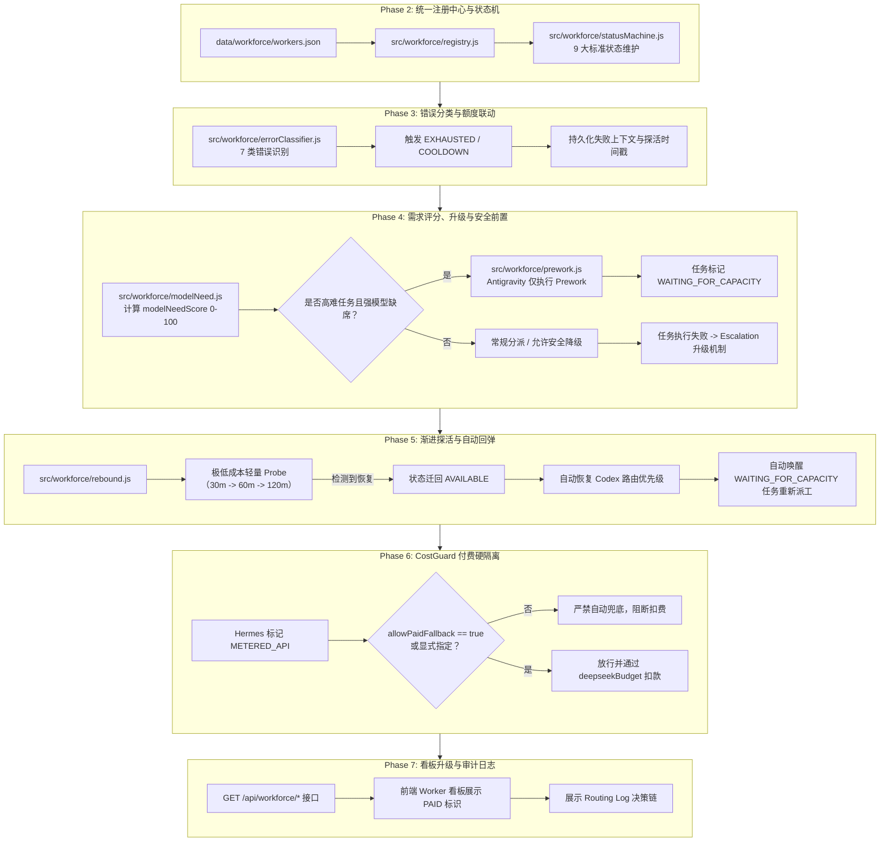

# WORKFORCE_ROUTER_AUDIT.md — AI Workforce Router 架构审计与改造规划

> **审计时间**：2026-09-03  
> **审计范围**：Worker 调用链、任务路由决策器、CostGuard 费用保护、Worker 探活与健康监控、错误分类处理、Task 数据模型、REST API 及前端控制看板。  
> **审计原则**：严格遵守 Phase 1 阶段要求——仅进行系统现状与复用性审计，制定详细文件改造清单与实施步骤，**当前阶段不修改任何业务代码**。

---

## 一、目前已经有什么（现状盘点）

系统目前已经具备了多 Agent 本机调度的基础设施，但各模块之间处于松耦合、规则硬编码的状态：

### 1. Worker 调用与执行层 (`src/adapters/`)
* **统一调用入口**：`src/adapters/runAgent.js` 统一接收 `(agent, task, project, config)`，并分发到对应适配器；
* **具体适配器**：
  * `codex.js`：调用本地 `codex exec`，以标准输入 JSON 流驱动，指定 `gpt-5.6-luna`；
  * `antigravity.js`：调用本地 `agy.exe`，指定 `gemini-3.8-flash-high` 和 `--permission-mode dangerous-bypass`；
  * `grokBuild.js`：调用本地 `grok.exe -p --always-approve`；
  * `claude.js`：调用本地 3456 端口反向代理或 `claude.exe`；
  * `hermes/bridge.js`：调用本地 `hermes.exe chat`，驱动 `gemini-proxy` 或 `deepseek`；
  * `grok-bot`：明确作为秘书对话接口，在 `runAgent` 中直接拒绝作为 Task Worker 派工。
* **进程守护**：`src/adapters/processRunner.js` 统一封装了子进程创建、超时强杀、标准输出截断与日志写入。

### 2. 任务路由与派发层 (`src/router.js`)
* **静态关键词匹配**：`chooseAgent(task)` 目前仅通过标题和描述包含的关键词做简单判断：
  * 含“编排/多agent”等 -> `hermes`
  * 含“摘要/总结/便宜”等 -> `deepseek`
  * 含“研究/调研”等 -> `grok`
  * 含“review/审查”等 -> `claude`
  * 其余一律默认为 -> `antigravity`
* **派发主循环**：`dispatchTask(taskId, config)` 具备高风险拦截检测、CostGuard 预检、派工运行、机器验收（`verifyTask`）和最多 3 次返工修复；
* **运行期 Fallback**：若 Worker 返回错误被判定为 `isWorkerUnavailable`，循环调用 `applyCostGuard("auto", ..., { skip })` 进行简单顺位替换。

### 3. 费用与配额保护层 (`src/workers/costGuard.js`, `src/workers/quota.js`, `src/billing/`)
* **CostGuard 守卫**：`applyCostGuard` 检查禁止的 API 模式、DeepSeek 预算上限以及 `data/quota/worker-quota.json` 中的 `exhausted` 状态；
* **顺位兜底链**：定义在 `src/workers/ids.js` 中的 `FALLBACK_CHAIN = ["codex", "claude", "antigravity", "grok-build"]`；
* **预算硬上限**：`deepseekBudget.js` 维护每月 ¥30 预算预占与扣费流水；
* **额度状态存储**：`src/workers/quota.js` 提供 `markQuotaExhausted`, `markQuotaNormal`, `setQuotaOverride`，记录于 `data/quota/worker-quota.json`。

### 4. 健康检查与探活层 (`src/workers/health.js`)
* **就绪态探测**：提供 `classifyCodexProbe`、`classifyGrokProbe`、`classifyHermesProbe` 对 CLI 的 status/models 命令回显进行轻量正则匹配；
* **状态枚举（分散）**：目前健康状态返回 `READY`, `INSTALLED`, `AUTH_REQUIRED`, `OFFLINE`, `UNKNOWN_CONTROL_INTERFACE`, `HEADLESS_PERMISSION_BLOCKED` 等。

### 5. 错误识别与处理
* 仅包含粗粒度的正则表达式匹配：
  * `isWorkerUnavailable(result)` 匹配 12 种关键字；
  * `isQuotaExhaustion(result)` 匹配 7 种额度关键字；
* 缺乏标准化的分类输出（无法区分是暂时限流、额度耗尽、认证失效还是执行逻辑崩溃）。

### 6. 任务数据结构 (`src/store.js`, `data/tasks/*.json`)
* 任务对象已具备：`id`, `title`, `description`, `agent`, `riskLevel`, `status`, `selectionPreview`, `executionHistory`, `verificationHistory`, `deliverables` 等；
* 尚无任务能力需求评估（`modelNeed`）、付费 Fallback 授权（`allowPaidFallback`）和创始人介入次数计数（`founderTouches`）。

### 7. REST 接口与控制看板 (`server.js`, `public/app.js`, `public/index.html`)
* 现有 Worker 看板路由：`GET /api/workers/board` 与 `POST /api/workers/:id/quota`；
* 前端 `#workerBoardSection` 渲染 Worker 卡片，具备标记额度用尽/恢复额度功能。

---

## 二、哪些可以复用（Reuse Matrix）

| 模块 | 现有实现文件 | 复用度 | 理由与复用方式 |
| :--- | :--- | :---: | :--- |
| **Worker CLI 适配器** | `src/adapters/*.js` | **95%** | 原生 CLI 进程拉起、环境变量代理注入、日志输出均稳定运行，直接沿用。 |
| **安全子进程执行器** | `src/adapters/processRunner.js` | **100%** | 超时、缓冲区限制、错误捕获完全可靠，无需修改。 |
| **高风险拦截与验签** | `src/tasks/risk.js` | **100%** | 高风险 Level 1 拦截、签名哈希校验必须原样保留，绝对不能弱化。 |
| **任务主状态机** | `src/store.js` | **90%** | 任务 CRUD、回收站与归档机制完备，仅需在任务字段中扩展 `modelNeed` 与 `allowPaidFallback`。 |
| **Prompt 组装与注词** | `src/router.js` (`buildPrompt`) | **100%** | 自动注入 Ponytail、Memory 上下文、Brief 简报、ReadScope 隐私边界的逻辑极为完善，直接复用。 |
| **验收与产物检查** | `src/verify/verifyTask.js` | **100%** | 机器验收准则（命令白名单、文件存在性、相对路径约束）直接复用。 |
| **DeepSeek 费用硬防线** | `src/billing/deepseekBudget.js` | **100%** | 预算预占、释放与月度总额硬熔断继续作为 Hermes 的底层安全锚点。 |
| **轻量探活正则** | `src/workers/health.js` | **85%** | 各 Worker 官方命令行状态检测逻辑精准，可直接供低成本 Probe 机制调用。 |

---

## 三、当前存在的核心矛盾与缺陷分析

1. **“所有模型没额度 → 所有任务全扔给 Antigravity”的危险倾向**：  
   现有 Fallback 链条只看 Worker 是否存活，不看任务性质。高难度架构修改（如重构调度器）如果遇到 Codex 额度不足，会被降级到 Antigravity，导致低质量修改或代码改坏。
2. **缺乏 Prework（前置准备）机制**：  
   强模型不可用时，系统要么强行报错停止，要么让弱模型冒险全权接管。没有“让 Antigravity 仅负责查文件、理调用链、写测试计划，然后将任务置为 `WAITING_FOR_CAPACITY` 挂起，等待强模型恢复”的分步工作流。
3. **缺乏 Rebound（自动回弹）机制**：  
   Codex 被标为 `exhausted` 后，哪怕过了一天额度重置，系统也无法自动探活并恢复其 Routing 优先级，也无法自动唤醒挂起等待容量的任务。
4. **Hermes 付费防线尚无任务级显式授权**：  
   虽然 `deepseekBudget.js` 限制了月度上限，但如果订阅模型相继宕机，缺乏显式的 `allowPaidFallback: false` 拦截，容易误触发付费调用。
5. **Worker 状态与错误分类割裂**：  
   `health.js` 维护物理安装状态，`quota.js` 维护额度状态，两者未形成统一的状态机（AVAILABLE, BUSY, LOW, THROTTLED, EXHAUSTED, COOLDOWN, PROBING, OFFLINE, ERROR）。

---

## 四、准备修改和新增的文件清单

遵从 Ponytail 极简原则与项目现有架构规范，采用**新增领域模块 + 最小化侵入修改**策略：

### 1. 新增文件 (NEW)

| 文件路径 | 职责与设计说明 |
| :--- | :--- |
| **`data/workforce/workers.json`** | 统一 Worker Registry：持久化各 Worker 能力标签（`capabilities`）、能力分值（`capabilityLevel`）、额度等级（`quotaClass`）、计费类型（`billingType`）、保留级别（`reserveForHighValue`）与状态。 |
| **`src/workforce/registry.js`** | Worker 注册中心管理器：读写 `data/workforce/workers.json`，提供初始种子数据，支持动态读取与更新。 |
| **`src/workforce/statusMachine.js`** | 统一状态机：管理 9 大状态（`AVAILABLE`, `BUSY`, `LOW`, `THROTTLED`, `EXHAUSTED`, `COOLDOWN`, `PROBING`, `OFFLINE`, `ERROR`），负责冷却时间计算与状态流转。 |
| **`src/workforce/errorClassifier.js`** | 错误识别器：将子进程抛出的错误精准归类为 7 大类（`QUOTA_EXHAUSTED`, `RATE_LIMITED`, `AUTH_ERROR`, `NETWORK_ERROR`, `WORKER_OFFLINE`, `EXECUTION_ERROR`, `UNKNOWN`）。 |
| **`src/workforce/modelNeed.js`** | 任务模型需求评估器：基于任务标题、描述与验收项，自动计算 `modelNeedScore` (0-100)，评估复杂度、风险、可逆性、推理深度，给出推荐 Worker 与等级（LOW, MEDIUM, HIGH）。 |
| **`src/workforce/prework.js`** | 安全前置工作流组装器：当强模型不可用时，为 Antigravity 构造只读/整理型 Prework Prompt，并规范产物保存格式。 |
| **`src/workforce/rebound.js`** | 探活与回弹引擎：实现渐进式低成本探活（30m -> 60m -> 120m），探活成功后将状态迁回 `AVAILABLE`，并自动扫描并唤醒 `waiting_for_capacity` 任务。 |
| **`src/workforce/routingLogger.js`** | 调度决策日志审计器：持久化记录每次路由决策的上下文（任务ID、入选 Worker、原因、Model Need 分值、是否降级、成本等级）。 |
| **`test/workforceRouter.test.js`** | 针对 V1 系统 7 大验收场景的自动化测试套件。 |

### 2. 修改文件 (MODIFY)

| 文件路径 | 修改范围与改动说明 |
| :--- | :--- |
| **`src/router.js`** | **核心改造点**： 1. 替换简陋的 `chooseAgent`，接入 `evaluateModelNeed`； 2. 改造 `dispatchTask` 中的 Fallback 逻辑：根据任务等级决定是安全降级、执行 Prework 还是挂起等待； 3. 在任务执行失败后接入 `classifyWorkerError`，自动触发 `COOLDOWN` 与配额标记； 4. 记录完整的 `Routing Log`。 |
| **`src/workers/costGuard.js`** | 强化付费模型拦截：检查 Worker 的 `billingType === "METERED_API"`，若任务未设置 `allowPaidFallback: true` 且非显式指定，严禁将其作为顺位兜底，宁可返回等待容量。 |
| **`src/store.js`** | 在 `createTask` 中注入 `modelNeed` 评估结果、默认 `allowPaidFallback: false` 与 `founderTouches: 1`；在状态过滤中增加对 `waiting_for_capacity` 的支持。 |
| **`server.js`** | 挂载新的 REST API： - `GET /api/workforce/status` - `GET /api/workforce/workers` - `GET /api/workforce/routing` - `GET /api/workforce/events` 兼容保留已有的 `/api/workers/board`。 |
| **`public/index.html`** & **`public/app.js`** | 在现有 `#workerBoardSection` 中轻量增强展示： 1. Hermes 增加醒目的 `PAID API · ￥` 警告徽章； 2. Codex 标注 `SCARCE · 高价值保留`，Antigravity 标注 `DEFAULT · 批量主力`； 3. 增加轻量级「调度决策日志」与「等待容量任务」卡片容器，不引入新框架。 |
| **`public/style.css`** | 补充新徽章（PAID、SCARCE、WAITING_FOR_CAPACITY）及决策日志条目的基础高定暗黑样式。 |

---

## 五、分阶段实施路线图 (Phase 2 ~ Phase 7)

---

## 六、测试验证规划（对齐用户 7 大验收场景）

在 `test/workforceRouter.test.js` 中完整编写以下 7 组独立单元与集成测试：

1. **TEST 1 (Normal Antigravity)**：普通轻量任务（修改样式/修正简单文案）自动评估为 LOW/MEDIUM，直接分派给 Antigravity，禁止无端消耗 Codex 额度；
2. **TEST 2 (Normal Codex)**：高复杂度任务（重构调度核心）评估为 HIGH，在 Codex 额度健康时精准分派给 Codex；
3. **TEST 3 (Codex Quota Exhausted + Prework)**：当 Codex 状态为 `EXHAUSTED` 时，高复杂度任务绝不允许 Antigravity 直接全权执行；系统指挥 Antigravity 仅完成上下文检索与方案分析（Prework），任务随后进入 `waiting_for_capacity`；
4. **TEST 4 (Rebound)**：模拟 Codex 经过低成本探活判定恢复，状态流转为 `AVAILABLE`，原本处于 `waiting_for_capacity` 的高难任务被自动识别并恢复执行；
5. **TEST 5 (Grok Build Fallback)**：普通调研任务在 Grok Build 额度紧张时可降级给备用 Worker，高价值战略调研任务则进入等待或提示；
6. **TEST 6 (Hermes Paid Protection)**：所有订阅 Worker 耗尽且任务未显式开启 `allowPaidFallback: true` 时，系统宁可置为等待，**绝对不自动调用 Hermes 产生账单**；
7. **TEST 7 (Explicit Hermes Approval)**：当任务显式设置 `allowPaidFallback: true` 或创始人明确指定 Hermes 且预算在允许范围内时，正常调用 Hermes 并准确记账。

---

## 七、当前状态总结与下一步动作

- **当前状态**：**Phase 1 审计与改造方案规划已完成**。
- **代码完整性**：未修改任何现有业务代码，全量原有回归测试（138/138）依然保持 100% 通过。
- **下一步动作**：等待创始人审查确认本审计报告与实施规划；收到批准后立即启动 **Phase 2（Worker Registry + Worker Status）** 的具体落地。
